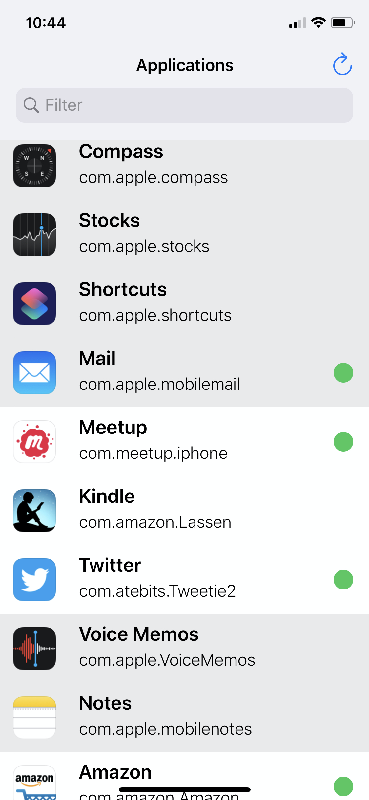
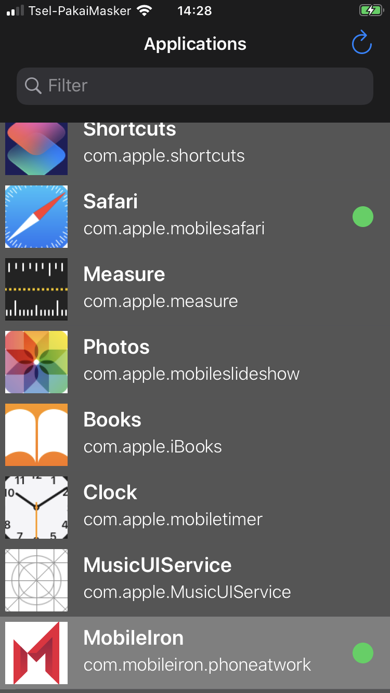
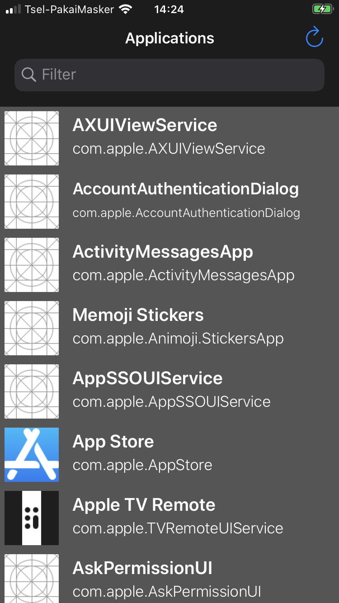

# yacd (Yet Another Code Decrypter)

Decrypts FairPlay applications on iOS 13.4.1 and lower, no jb required 

Dark Mode:

This application uses [@s1guza](https://twitter.com/s1guza)'s [Psychic Paper](https://siguza.github.io/psychicpaper/) exploit to be able to read other process memory and the iOS filesystem.

Many alternatives already exist ([original?](https://github.com/stefanesser/dumpdecrypted), [Frida version](https://github.com/AloneMonkey/frida-ios-dump), [past favorite](https://github.com/BishopFox/bfdecrypt)). This was written primarily for a case where I want to get a decrypted IPA from my iOS device and Airdrop it to a computer

## Compile 
You'll need Xcode 12 for the xcproject

Change around the Singing identity and build for an iOS 13.4.1 or lower device. If successful, you'll see the list of GUI applications on your iOS device.

## Usage
First, launch a 3rd party application, then decrypt it from the yacd app. Have a receiving computer with Airdrop available nearby.

## Credits 

[@s1guza](https://twitter.com/s1guza)'s already mentioned [Psychich Paper](https://siguza.github.io/psychicpaper/)  
[@@rodionovme](https://twitter.com/rodionovme)'s [liblorgnette](https://github.com/rodionovd/liblorgnette) as a starting point
